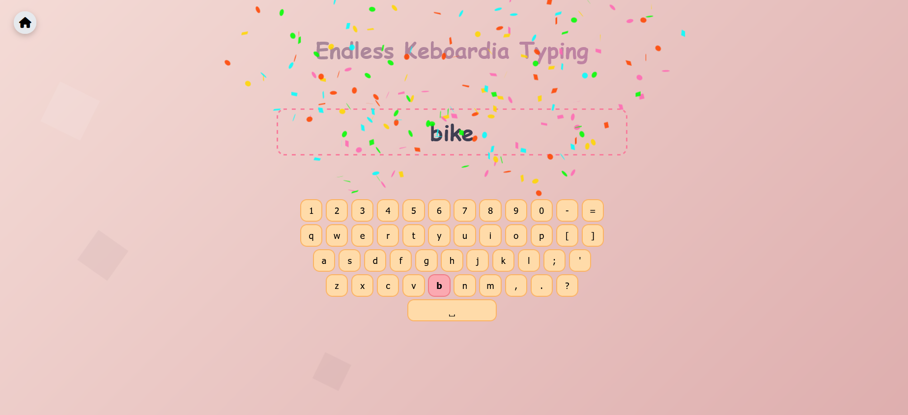
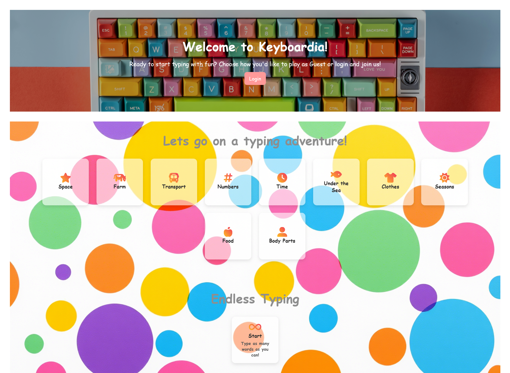
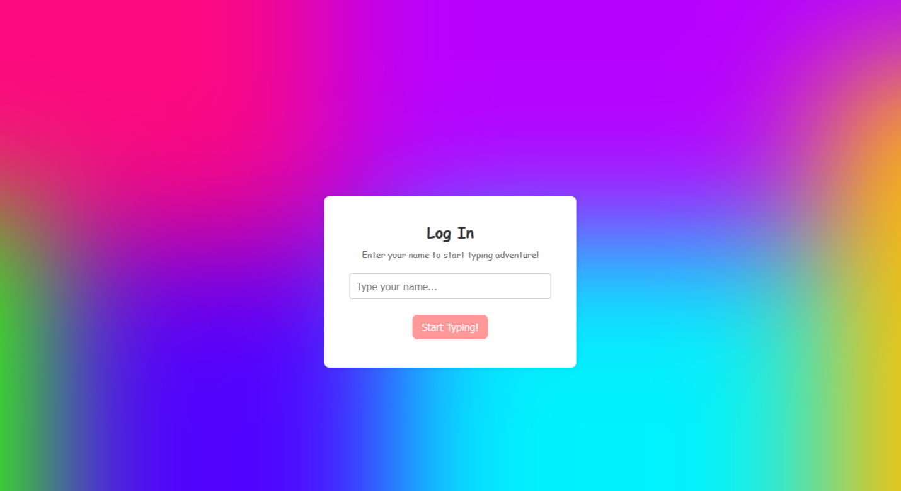
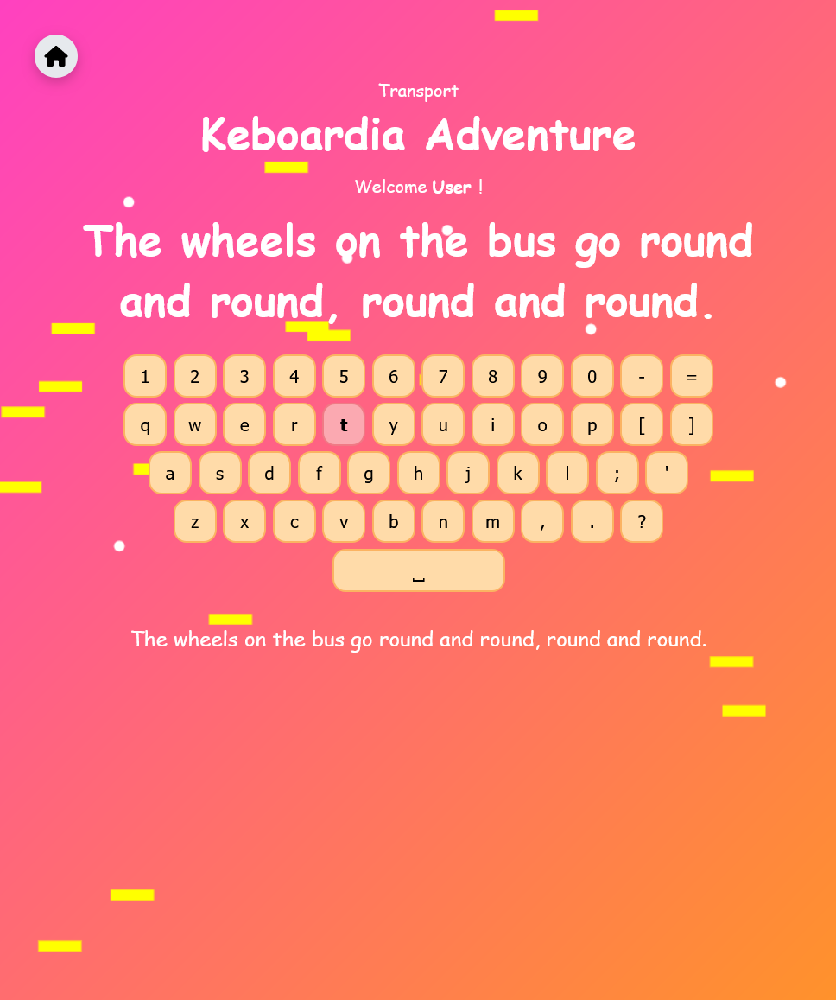
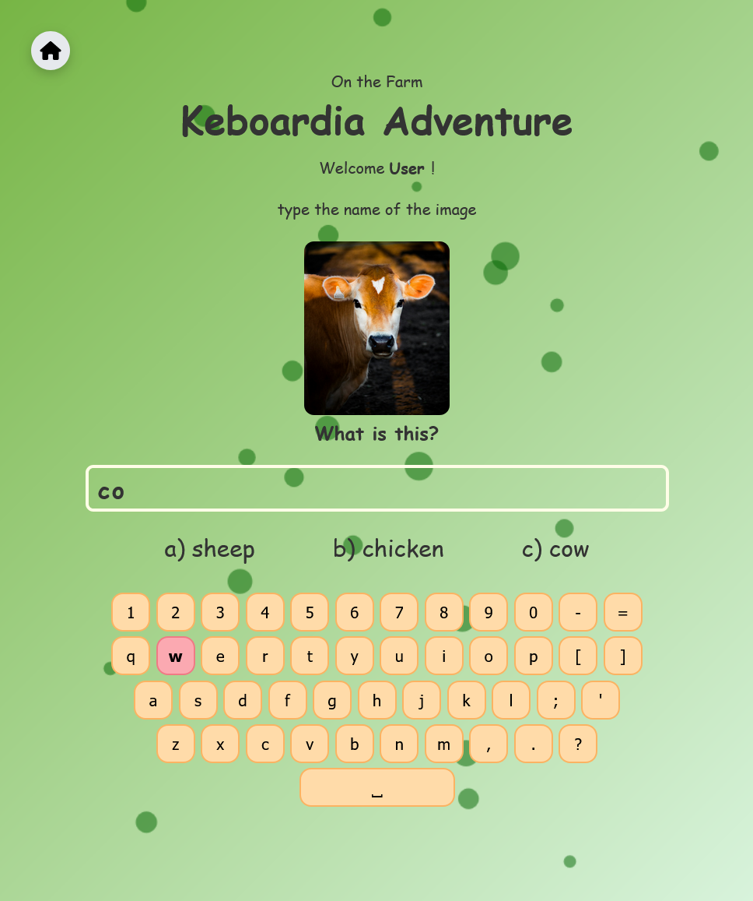
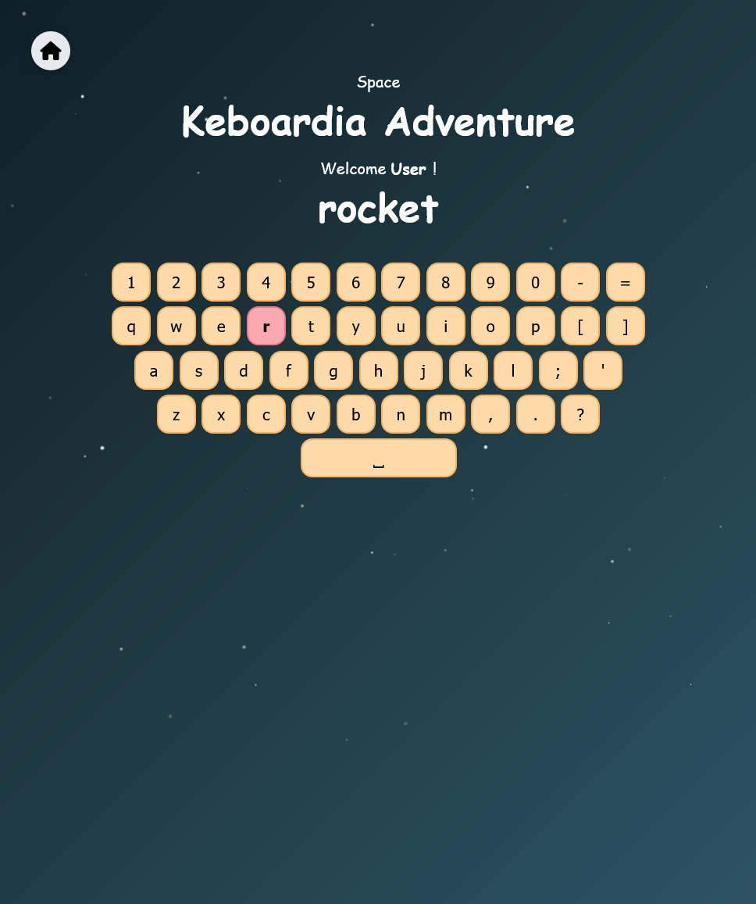
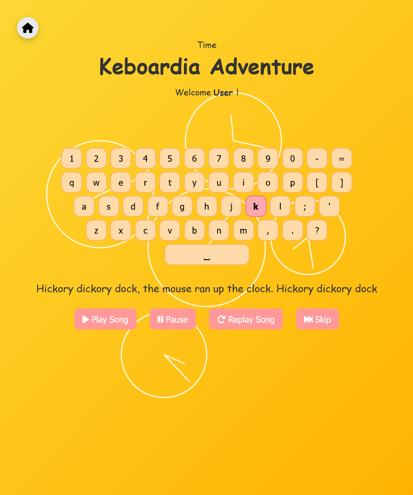

# ⌨️ Keyboardia – Interactive Typing Game for Kids 🎉

**Keyboardia** is an educational typing adventure designed for children aged 4–13 to learn how to type using a keyboard through fun, themed levels, nursery rhymes, quizzes, and animations.

Each level features a different world like **Space**, **Farm**, **Vehicles**, and more. Kids type words, answer related questions, and follow along with classic nursery rhymes — all while getting instant feedback, sound effects, and confetti celebrations!

---

## 📷 Screenshots
  
  
  
 
 
 

  

---

## 🎮 How It Works

### 🧩 Typing Levels
- Play as Guest or Login
- Children choose a world or endless
- Type each word letter-by-letter
- Keys glow when pressed
- Highlight shows the next expected letter

### 🧠 Interactive Quiz
After finishing all words in a Stage, players are shown a multiple-choicewith an image question related to the theme:
- Example: “What is in the image?”  
  A) Car  
  B) Tractor  
  C) Grass

Correct answers unlock the next Stage.

### 🎵 Nursery Rhyme Integration
Kids type along with classic songs like:
- Twinkle Twinkle Little Star
- The Wheels on the Bus
- Head, Shoulders, Knees and Toes

This helps reinforce vocabulary and listening skills.

### ⏱️ Endless Typing Mode
A special mode where random words appear continuously:
- Great for building speed and accuracy

---

## 🧱 Technical Details

| Feature | Description |
|--------|-------------|
| Backend | Flask (Python) |
| Frontend | HTML, CSS, JavaScript |
| Database | SQLite (for username) |
| Themes | Each level has a unique background and color scheme |
| Sound Effects | Ding for correct letters, buzz for wrong ones |
| Confetti Celebrations | Canvas-confetti library used after every correct word or level finish |
| Guest Support | No login needed for quick play |

---

## 🧑‍🏫 Educational Benefits

**Keyboardia** helps young learners develop key digital literacy skills:

| Benefit | Description |
|--------|-------------|
| ✍️ Typing Practice | Letter-by-letter typing improves motor coordination and recognition |
| 👁️ Visual Tracking | Highlighted letters help kids focus on spelling |
| 🧠 Memory Development | Quizzes and rhymes improve recall and retention |
| 🖥️ Digital Literacy | Introduces use of computer input devices |
| 💬 Vocabulary Building | Each level introduces new, theme-based words |
| 🕹️ Gamified Learning | Fun + learning = better engagement and motivation |

---

## 🚀 Future Ideas & Improvements

We're excited to expand **Keyboardia** even further! Here’s what we’re planning:

### 🧩 New Features
- 📊 WPM Tracker and Accuracy Percentage
- 📋 Progress Dashboard for Teachers
- 📤 Export Student Progress to CSV
- 🧑‍🤝‍🧑 Multiplayer Typing Races
- 🗣️ Voice-guided instructions for non-readers

### 📱 Mobile App Version
- Wrap the game in a mobile WebView for Android/iOS
- Touch-friendly layout
- Offline support via local storage

### 🧪 Enhanced Typing Modes
- ⌨️ Advanced Keyboard Training
- 🎯 Custom Level Creator (for teachers/parents)
- 🧠 Adaptive Difficulty (learners get harder words as they progress)

### 🎨 UI Enhancements
- 🐱 Cute animated characters
- 🎇 Floating bubbles/confetti themes per level
- 🎨 More colorful backgrounds with scribbles and doodles

### 🧑‍🏫 Classroom Tools
- 📚 Teacher login and student tracking
- 📝 Word list customization
- 📊 Performance analytics

---

## ❤️ Acknowledgments

Special thanks to:
- [Unsplash](https://unsplash.com/ ) – for beautiful, royalty-free images
- [Font Awesome](https://fontawesome.com/ ) – for playful icons
- [Canvas-confetti](https://www.npmjs.com/package/canvas-confetti ) – for joyful celebration effects
- [Flask](https://flask.palletsprojects.com/ ) – for simple backend handling

---

## 📬 Contact

Have ideas, feedback?

💻 GitHub: **github.com/MaryamBinabdullah**

---

## 🎈 Thank You!

Thank you for checking out **Keyboardia** — a typing adventure made with love for little learners! 💖✨🚀